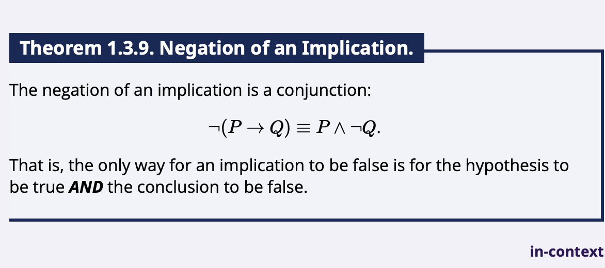
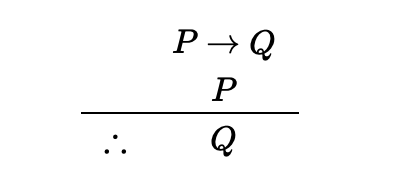

# Chapter 1.3

## Try it 1.3.1

First we should make variables
p = purple shirt
q = green vest
r = tweed vest
s = bow tie
t = red shoes

s = true

q | t

(p & q) => ~s

q => p | t

p => t

Let's make a truth table

Must be q, s, t

## Implications + Tautologies

$p \rightarrow q \vee q \rightarrow p$

...is a tautology.

## De Morgan's Laws

$\neg (P \lor Q) = \neg P \land \neg Q$

$\neg (P \land Q) = \neg P \lor \neg Q$

## Implications as disjunctions

$P \rightarrow Q = \neg P \lor Q$

## Implication Negations

# Deductions

Written like this:

## Additional exercises: my answers

1. No
2. Skipped

3a. (P or Q) => Q

3b. Same as implication truth table

3c. Can't conclude anything if we know there's cake

3d. It isn't my birthday

4. p or s, s => q, (p or q) => r. We don't yet know if geoff is a liar or truth teller

5. The statement is correct because you said it was correct. Having the variable on the right side of the implication be false while the one on the left side is true is the only way for an implication to be false.

6a. P and Q
